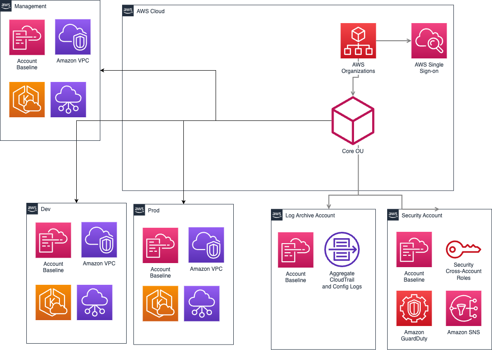
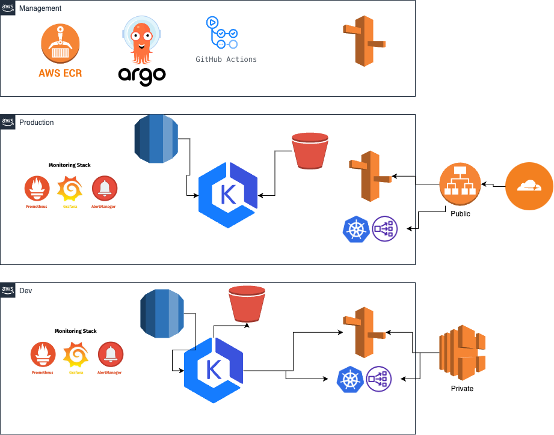

# platomics-homework

## Requirements 
* kubernetes cluster (tested with kind)
* cilium CNI 
* helm 

## Part 1 . 

Solution compilated in a helm chart. 

## Part 2

Creating a production environment for containerized applications with a focus on security, developer self-management, and collaboration involves leveraging modern DevOps practices and tools. Here’s a plan for achieving this:

### Technologies and Tools
* Kubernetes: The primary orchestration platform for containerized applications. EKS

* Docker: For containerizing the applications.

* Helm: To manage Kubernetes applications using Helm charts.
* GitOps: Using tools like ArgoCD to manage and automate Kubernetes deployments.
* Ingress: AWS Apps Load Balancer and CDN 
* Artifact repository: AWS ECR 
* CI/CD Pipelines: Utilizing GitHub Actions
* Observability: Implementing Prometheus for monitoring, Grafana for visualization, and EFK (Elasticsearch, Fluentd, Kibana) for logging.
* Security: Follow well architected framework best practice for security 
* Cloud Provider: AWS

### Proposed Architecture

Here’s a diagram to illustrate the proposed architecture:

Diagram 1 

Diagram 2 

### Network Requirements 
* 3 AZ
* AWS Internal endpoints for services 
* Subnets 
    * Public 
    * Private
    * Data

### CI 

Github actions or ArgoCD workflow to setup verification and build pipelines 

### Deployments 

ArgoCD 

### IaC 
*   terraform 

### secrets management 
* Hashicorp Vault or AWS secret manager